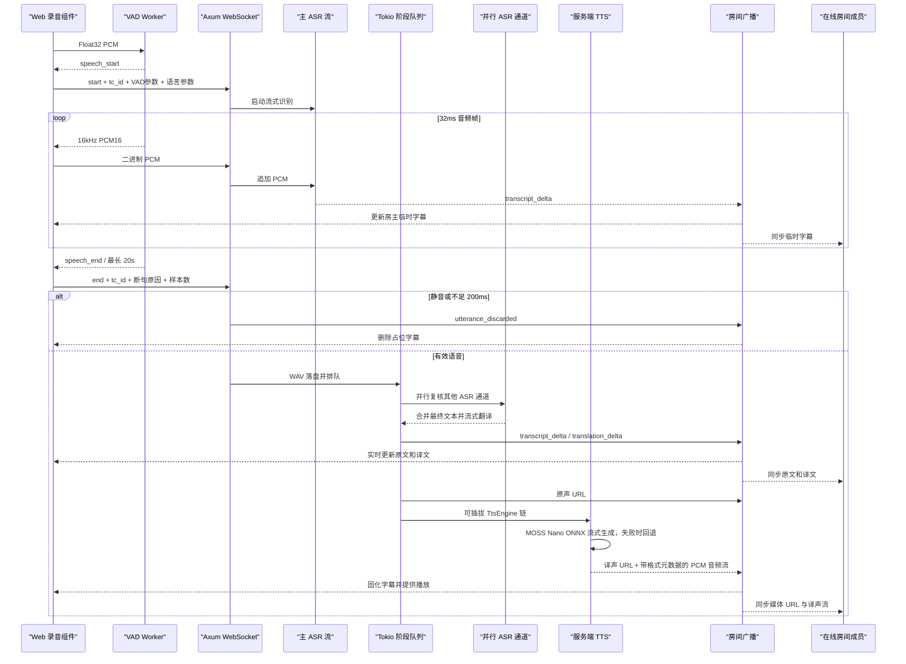

# 浏览器 VAD 与服务端 ASR 架构

## 最终方案



浏览器 VAD 是唯一分句实现。WASM 或 Worker 初始化失败时，录音不会开始，页面直接显示错误；系统不再静默切换到服务端 VAD，也不会上传连续静音 PCM。

## 方案选择

| 方案 | 优点 | 当前风险 | 结论 |
| --- | --- | --- | --- |
| `silero-vad-rust + wasm-bindgen` | 常见绑定工具，验证快 | 候选 `silero-vad-web 0.1.0` 仍是未实现脚手架；基于 ONNX Runtime 的路径还会引入另一套 Web runtime | 不采用该 crate 作为生产实现 |
| Lele + Silero | 纯 Rust AOT、无 ONNX Runtime 浏览器依赖、单一 WASM、支持 Silero | 约 4.3 MiB，社区和模型算子覆盖仍需持续验证 | 当前实现 |
| WebRTC VAD | 体积小、语音通话场景成熟 | C 依赖交叉编译复杂，噪声适应性弱于 Silero | 已从服务端和浏览器移除 |

当前实现固定使用 `lele = 0.1.12` 和 Silero VAD v6.2。模型以 512 样本窗口运行，Silero 概率、音量和动态噪声底共同判定人声开始；静音期持续学习环境噪声底，但噪声底最高限制为 RMS 0.012，避免持续底噪把低声说话门槛抬得过高。默认模式会回放触发前 512 ms 的 PCM。操作人员可在设置中启用“增强分段过滤”：WASM 使用 1 秒校准和 pre-roll 识别持续低频周期噪声，检测到人声频率结构恢复后再候选启动；Worker 累计至少 6 个确认帧才向主线程发布 `speech_start`，随后补发缓存 PCM，既不触发无效 ASR，也不截掉句首。活动段约 3 秒连续静音后结束，能量判定只允许覆盖短暂的模型漏检，不能被背景声无限续段。每段还会统计确认的人声帧，不足约 200 ms 的瞬态噪声会在进入 ASR 前丢弃。每次结束会重建模型运行状态并恢复启动门限，使下一次说话可以独立触发。Rust/WASM 会对每个完整输入帧输出 RMS 音量，即使尚未判定为语音，页面波形也能反映真实麦克风输入。房间的 `max_utterance_seconds` 限定为 5~20 秒，并会强制形成下一条记录，同时保留短接续窗口。

浏览器默认启用系统回声消除和噪声抑制，两项可由用户独立关闭；容易抬高底噪的自动增益保持关闭。自动或手动播放译声时，采集链路进入半双工抑制状态：当前分段先结束，播放期间不再向 VAD 提交扬声器回采样本，播放队列清空后自动重置并恢复聆听。

`audio-processor.js` 仍然必要。AudioWorklet 是浏览器实时音频线程到 Worker 的最小桥接层，但它只复制 Float32 输入；抗混叠低通滤波、重采样、PCM 转换、音量、分帧、VAD、pre-roll 和断句全部在 Rust/WASM 中完成。常见的 48 kHz 麦克风输入在降采样到 16 kHz 前先经过流式 FIR 低通滤波，避免 8 kHz 以上的设备噪声折叠到可听频段。设置页和录音按钮下方分别提供“系统降噪”与“回声消除”：前者独立控制浏览器 `noiseSuppression`，后者独立控制 `echoCancellation`，两项默认开启并在下一次采集时生效。外置声卡已经完成降噪时可仅关闭系统降噪；使用耳机、不存在扬声器回采时可仅关闭回声消除。

## ASR 保持在服务端

Qwen ASR 不迁移到浏览器：

1. 模型下载、内存和多标签页重复实例会明显增加终端负担。
2. 移动端 WebGPU、WASM 和内存能力差异会使时延不可预测。
3. 服务端需要集中保护模型、调度推理，并产生可信的用户、房间、WAV 和转写记录。
4. 端侧 VAD 已减少静音带宽和服务端逐帧计算；迁移 ASR 的收益与成本不匹配。

TTS 同样由服务端统一执行。业务流水线只依赖 `TtsEngine` trait：默认尝试 MOSS-TTS-Nano ONNX，首个音频块产生前失败时，中文回退到 Kokoro INT8，其余配置语言回退到 Supertonic 3 INT8。音频块产生后立即通过 WebSocket 交付；完成后按引擎实际采样率和声道数落盘，并发布受保护媒体 URL。

## 房间实时同步

房主仍是唯一实时音频发布者：只有房主连接可以发送配置、VAD 边界和 PCM。已加入房间的成员建立只读 WebSocket 订阅，服务端按 `room_id` 将转写增量、译文增量、处理状态、原声/译声 URL、延迟数据和译声 PCM 有序广播给所有在线连接。成员不能通过该连接启动第二条识别流水线。

房间广播使用单进程内存通道，不复制推理任务或 TTS 任务。新成员先加载持久化历史，再建立订阅，并在订阅确认或自动重连后执行一次增量历史对账，以覆盖 HTTP 响应与 WebSocket 建连之间的短窗口。中途加入译声 PCM 的客户端若未收到对应 `audio_start`，会丢弃无法定界的二进制片段，随后仍可通过受保护的译声 URL 完整播放。多实例部署需要将房间广播替换为 Redis、NATS 等跨实例消息总线。

## 安全边界

WASM 不是可信边界。服务端仍执行以下限制：

- WebSocket 要求登录 cookie；房主可以发布实时音频，已加入房间的成员只能订阅房间事件。
- 服务端校验每段唯一的 UUID `tc_id`，并将断句上限限定在 5~20 秒。
- 只接受匹配 `start` 与 `end` 之间的固定 1024-byte PCM16 帧。
- pre-roll 突发之后只允许有限的实时发送速率，超速帧会被丢弃。
- 客户端漏发结束边界时，服务端仍按房间上限或 `flush` 收束当前记录。
- 用户、房间、音频路径和最终转写始终由已授权的服务端会话落库。

## 构建与部署

```bash
./scripts/build-web-vad.sh
./scripts/setup-server-tts.sh
cd web && npm run build
```

WASM 源文件输出到 `web/static/wasm/voice_elf_web_vad.wasm`。SvelteKit 静态构建将其复制到 `web/dist/wasm/`，Axum 再从 `web/dist` 提供 SPA 路由和静态资源。
