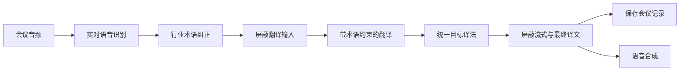

# 行业术语与屏蔽词功能说明

## 目标

行业词库用于提高会议语音识别后的专业名词准确度，并确保译文采用统一译法。屏蔽词库用于阻止敏感内容进入翻译服务、实时译文、持久化译文和语音合成。

## 操作流程

1. 系统管理员进入“系统管理 > 词库管理”。
2. 在“行业术语”中创建词库，填写行业、语言方向和说明。
3. 单条新增术语，或导入 CSV：`source_term,target_term,aliases,priority`。多个别名使用 `|` 分隔。
4. 房主在房间设置中选择行业词库。未选择时保持通用识别与翻译行为。
5. 在“屏蔽词”中维护全局规则，选择包含匹配或完整词匹配，以及是否区分大小写。
6. 词库状态或内容修改后，新开启的会话立即采用最新规则；正在进行的会话在重新连接后刷新策略。

## 处理链路



术语按优先级和长度匹配，较长词优先，降低短别名误替换的风险。英文及数字术语默认采用完整单词边界匹配，中文术语采用包含匹配。

## 数据安全

- 词库、术语、屏蔽词和房间绑定均采用软删除，删除后保留历史记录。
- 只有系统管理员可维护词库和屏蔽词。
- 只有房主可修改房间的行业词库绑定，参与者只能查看。
- 导入文件限制为 1 MB、5000 条；错误按行返回，成功记录不受其他错误行影响。
- 屏蔽词在发送给翻译服务前执行，并再次应用于流式译文、最终译文和 TTS 输入。

## 导入示例

行业术语 CSV：

```csv
source_term,target_term,aliases,priority
Kubernetes,Kubernetes,k8s|kube,200
心房颤动,atrial fibrillation,房颤,180
```

屏蔽词 CSV：

```csv
word,replacement,match_mode,case_sensitive,note
敏感示例,***,substring,false,演示规则
secret,***,word,false,英文完整词
```
