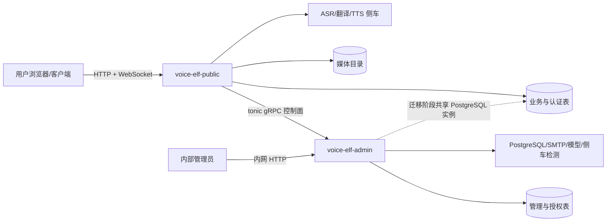
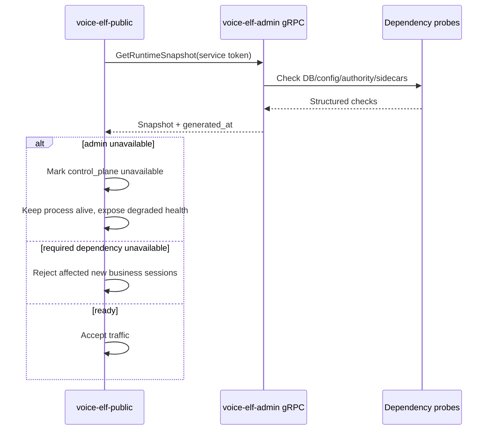

# Voice Elf 服务拆分分析与实施方案

## 1. 目标与结论

本次将现有单体后端拆为两个可独立构建、启动和部署的服务：

| 服务 | 对外入口 | 核心职责 | 不负责 |
| --- | --- | --- | --- |
| `voice-elf-public` | 公网 HTTP/WebSocket | 登录与会话、房间、成员实时语音、字幕、媒体、用户自助、推理管线 | 平台授权签发、系统初始化、人员和运行引擎管理 |
| `voice-elf-admin` | 内网 HTTP + gRPC | 环境部署检测、系统初始化、Key/授权、人员、ASR/TTS 和运行依赖管理 | 公网 WebSocket、实时语音管线、业务媒体传输 |

两个服务通过 tonic gRPC 的控制面契约通信。第一阶段保留同一个 PostgreSQL 作为迁移桥梁，但禁止 public 暴露 `/api/admin/*`、`/api/setup/initialize` 和授权总线写接口；public 仅保留前端启动所需的 `/api/setup/status` 只读状态。后续按表所有权迁移，最终使 public 不再直接写管理域数据。

方案适配度结论为 **fits with adjustments**：现有代码已有租户数据面与授权控制面概念，但它们仍在同一进程、同一 `AppState` 和同一路由树中。应先建立进程与契约边界，再迁移数据所有权；一次性拆库会同时改变路由、认证、实时连接撤销、迁移归属和部署方式，风险不可控。

## 2. 现状证据

### 2.1 已确认事实

1. 当前只有 `voice-elf-server` 一个包和一个主进程，`server/src/main.rs` 同时初始化数据库、授权、ASR/TTS、邮件、媒体、房间中心、REST、WebSocket 和静态资源。
2. `server/src/api.rs::router()` 把公共认证/房间接口与 `/admin/*`、`/setup/*`、授权总线、ASR/TTS 管理接口合并到同一 Router。
3. `AppState` 是公共业务与管理业务共享的状态容器；管理员停用人员和结束房间时还会直接调用 `RoomHub` 撤销在线连接。
4. `Database::connect()` 同时负责建库检测和运行 Diesel migrations，所有业务表与管理表目前属于同一迁移集合。
5. `AuthorityService` 已实现 standalone/bus/tenant 三种模式和租约快照，但 bus HTTP 接口和 tenant 业务执行入口仍在同一进程。
6. `3e58b3d feat: add admin, tenant authorization, and ASR management (2026-08-06)` 一次引入了管理员、初始化、授权总线、ASR 管理和前端管理页，是当前高耦合边界的主要形成点。

### 2.2 推断与未知项

- 推断：管理端应部署在内网或独立受控入口，因为其能力包含密钥签发、模型安装和人员状态变更；仓库当前没有反向代理或网络策略，生产网络隔离仍由部署系统实现。
- 推断：人员管理属于 admin，但用户登录态和房间成员身份是 public 的实时请求关键路径。因此第一阶段人员表允许双服务读取，管理写操作只归 admin。
- 未知：生产是否要求 public 在 admin 完全不可用时继续提供已有会话。方案默认采用“可观测降级”：短时不可达不阻止进程启动，授权快照或强依赖失效时拒绝受控业务。
- 未知：是否已有统一服务发现、mTLS 或 Secret Manager。第一阶段使用显式 gRPC 地址和共享 Token；生产应替换为 mTLS/服务网格身份。

## 3. 目标架构

依赖方向必须保持单向：`public -> admin control API`。admin 不调用 public 的内部函数；确有实时撤销需要时，通过 gRPC 命令或事件契约完成，不能重新共享 `RoomHub` 内存对象。

## 4. 职责和数据所有权

### 4.1 Public 数据面

- 公网入口：`/api/auth/*`、`/api/rooms/*`、`/api/voice-references/*`、`/api/tts/voices`、导出、`/media/*`、`/ws`。
- 业务状态：登录 session、房间、成员关系、语音 session、utterance、用户参考音色、媒体文件。
- 运行能力：ASR/翻译/TTS 会话创建、房间广播、延迟和失败事件。
- 控制面消费：部署是否初始化、实例授权是否允许、管理服务连通性、配置版本和依赖告警。

### 4.2 Admin 控制面

环境部署检测子域：

- 配置存在性和格式检测，不返回 secret 原文。
- PostgreSQL 连接与 migration 状态。
- Web 静态资源、媒体目录、模型/二进制/管理脚本可用性。
- SMTP 配置状态与侧车健康。
- FunASR、Qwen TTS 等可选语音侧车的真实网络握手和健康状态。
- gRPC 自身监听状态和 public 最近探测时间。

业务管理子域：

- Key 控制：实例签发、密钥轮换、撤销、短期令牌和审计。
- 授权管理：租户、期限、宽限期、离线租约、ASR/TTS entitlement。
- 人员管理：创建/导入、角色、审核、停用/恢复、密码重置。
- 运行管理：ASR/TTS 默认值、租户覆盖、音色别名、IndexTTS 生命周期。
- 系统初始化：部署资料和首个管理员。

### 4.3 表归属

| 表/资源 | 最终写入者 | Public 权限 | Admin 权限 |
| --- | --- | --- | --- |
| `rooms`, `room_members`, `voice_sessions`, `voice_utterances`, `voice_references` | public | 读写 | 通过管理 RPC 查询/处置 |
| `auth_sessions`, `password_reset_tokens` | public | 读写 | 只发管理命令 |
| `users` | admin | 登录所需投影读取 | 权威读写 |
| `system_installations` | admin | 读取初始化投影 | 权威读写 |
| `authority_*` | admin | 只读授权快照 | 权威读写 |
| `asr_system_settings`, `tts_system_settings`, `tts_voice_aliases` | admin | 读取版本化配置投影 | 权威读写 |
| 媒体目录与实时 `RoomHub` | public | 独占 | 无直接访问 |

第一阶段两个服务仍使用同一 `DATABASE_URL`，但以路由和模块约束写入者。第二阶段增加 gRPC 查询/命令与 public 本地只读缓存；第三阶段才允许物理拆库。

## 5. gRPC 控制面契约

首批契约使用 `voiceelf.control.v1.ControlPlane`：

| RPC | 调用方 | 用途 | 失败策略 |
| --- | --- | --- | --- |
| `GetRuntimeSnapshot` | public/运维 | 初始化、授权、数据库和依赖状态 | public 保留最近状态并标记 stale |
| `CheckReadiness` | public/编排器 | 判断控制面是否满足启动/接流量条件 | 返回结构化检查项，不用字符串解析 |

响应中的每个依赖包含 `name`、`kind`、`required`、`status`、`message`、`checked_at`。状态固定为 `ready`、`degraded`、`unavailable`、`unknown`。后续版本增加人员命令、配置流和实时撤销时只能向 `v1` 增字段或新增 RPC；破坏性变更发布 `v2`。

安全要求：gRPC 默认绑定回环或内网地址；共享 Token 至少 32 字节，只从环境变量读取且日志脱敏。生产必须使用 mTLS 或服务网格身份，不能把 gRPC 端口暴露到公网。

## 6. 启动检测和可视化提醒

每个服务启动分成三层结果：

1. `fatal`：自身配置无法解析、监听地址冲突、必需目录无法创建。进程退出。
2. `not_ready`：数据库或 admin 控制面等运行时强依赖不可用。进程保留健康端点，但 readiness 为失败。
3. `degraded`：SMTP、可选模型或可选侧车不可用。核心服务可接流量，管理页面展示告警。

Public 暴露 `/api/runtime/dependencies`，返回 admin gRPC 快照和 public 本地检查；`/api/health` 同时提供总体状态。前端管理页消费同一结构化数据，以红/黄/绿状态展示，不从日志文本推断。启动日志也逐项打印检查结果，便于无 UI 环境诊断。

## 7. 实施顺序

### 阶段 A：本次基础拆分

1. 把 server 变成可复用 library，保留兼容入口。
2. 将 API Router 拆为 public/admin 两棵路由树。
3. 新增 `voice-elf-public`、`voice-elf-admin` 二进制和独立 bind 配置。
4. 新增 tonic proto、admin gRPC server、public gRPC client。
5. 新增结构化依赖检查和 public 可视化 JSON 入口。
6. 更新 `.env.example`、Makefile、开发启动方式和运维文档。

### 阶段 B：收紧运行时所有权

1. 人员管理写操作只在 admin 保留；public 仅保留注册/登录所需命令。
2. [已完成] 管理员结束房间、停用人员改为 admin 发流式 gRPC 命令，public 幂等执行实时断连。
3. ASR/TTS 配置通过带版本号的 gRPC 快照下发；public 不直接读设置表。
4. 配置更新使用幂等 command ID，并记录操作审计。

### 阶段 C：拆分存储

1. 建立 users/entitlement/config 的 public 只读投影。
2. 双读比对，确认投影与 admin 权威数据一致。
3. 将 `authority_*`、人员和系统配置迁入 admin 数据库。
4. 删除 public 对管理 schema 的 Diesel 依赖和共享数据库权限。

## 8. 验收标准

- `voice-elf-public` 的路由表中不存在 `/api/admin/*`、`/api/setup/initialize` 和授权签发接口；只读 `/api/setup/status` 可用。
- `voice-elf-admin` 不开放 `/ws`、业务房间写接口或媒体目录。
- 两个二进制可分别构建、监听不同端口并单独停止/重启。
- admin 可用时，public 的依赖接口显示 gRPC、数据库、初始化和授权检查结果。
- admin 不可用时，public 进程仍存活，健康状态明确为 degraded/unavailable，且不伪报 ready。
- gRPC 未携带正确服务凭据时返回 `Unauthenticated`。
- 原单体兼容入口在迁移窗口内仍能构建，现有 REST/WebSocket 协议回归通过。
- `cargo fmt --check`、`cargo test --workspace` 和 Web 构建通过。

## 9. 风险与回滚

- 共享数据库是明确的阶段性耦合，不代表最终拆分完成；必须通过数据库角色和第二阶段 RPC 逐步退出。
- 实时撤销已通过 gRPC 命令流补齐；当前队列仍为 admin 进程内缓存，生产高可用需要持久化 outbox 与 public ACK。
- 两个进程若都执行 migrations，部署时需要数据库 advisory lock 或单独 migration job；当前 Diesel migration 互斥能力需在生产编排中验证。
- 回滚时可继续启动兼容 `voice-elf-server`，数据库 schema 本阶段不做破坏性变更。

## 10. 复现范围与限制

- 仓库：`/Users/lee/Documents/GitHub/voice-elf`
- 分析版本：`488a43b8c12da63b78f804a9398150cd72ceceba`
- 历史范围：当前分支全部 17 个提交，非 shallow clone；2026-08-11 已刷新 `origin/main`。
- 主要命令：`collect_git_evidence.py --max-commits 2000`、`find_business_context.py`、`rg`、`git log`、`git show 3e58b3d`。
- 未包含生产基础设施、真实流量、数据库规模、反向代理和 Secret Manager 配置，因此容量、mTLS 落地方式和零停机迁移窗口仍需在目标环境验证。
