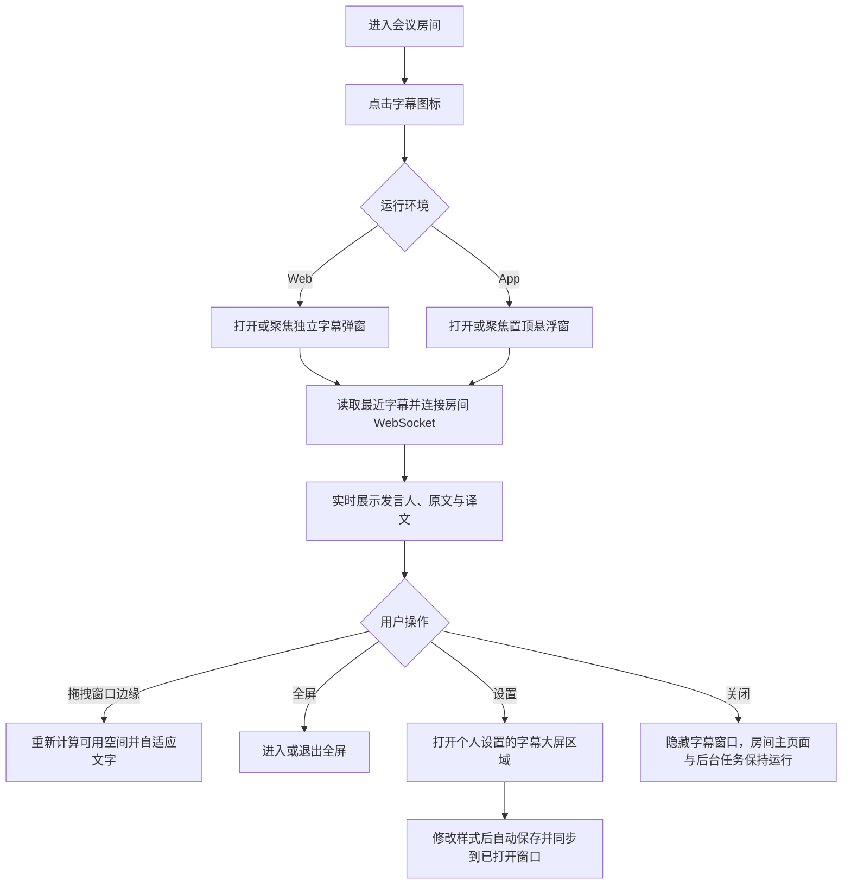

# 字幕大屏功能与交互流程

## 功能边界

字幕大屏是会议房间的只读实时显示面，展示当前发言人的原文、译文或两者。它不采集麦克风，也不主动播放语音；声音采集和自动播报仍由房间主页面负责。自动播报默认关闭，播报人可在个人设置中选择 13 个内置参考声或当前账号保存的自定义音色。

支持两种运行形态：

- Web：从房间工具栏打开独立弹窗，默认尺寸为 1100 x 460，可拖拽窗口边缘调整大小，也可进入浏览器全屏。
- App：从房间工具栏打开独立原生悬浮窗，默认尺寸为 1100 x 460，最小尺寸为 420 x 180，支持移动、缩放、最小化和 macOS 原生全屏，非全屏时保持置顶。每个房间复用一个字幕窗口。

字幕路由为 `/rooms/{room_id}/subtitles`。打开时会校验登录态和房间权限；尚未加入但可访问的用户会先加入房间，再建立实时连接。

## 用户流程

## macOS 窗口与后台运行

- 字幕页工具栏的最小化、全屏和关闭按钮通过 App Shell 调用 Native 窗口 API；浏览器页面仍使用浏览器全屏与普通弹窗关闭语义。
- 字幕窗口与主窗口使用一致的原生标题栏能力。全屏会进入 macOS 原生全屏 Space，并在进入时临时取消悬浮置顶；退出全屏后恢复置顶。
- 主窗口、字幕窗口和设置窗口的关闭按钮只隐藏窗口，不销毁 WebView，也不结束会议连接。点击 Dock 图标可恢复主窗口。
- macOS 状态栏菜单提供“显示 Voice Elf”“显示字幕大屏”“字幕大屏设置”和“退出 Voice Elf”。没有已打开字幕窗口时，“显示字幕大屏”会唤醒主窗口并提示先进入会议房间。
- `Command + Q`、应用菜单退出和状态栏退出都会先唤醒主窗口，显示短时提示并要求确认。只有用户明确确认后进程才退出；取消后应用继续后台运行。

## 实时字幕生命周期

1. 字幕页只读取房间名称和访问权限，不回填任何历史记录；当前无人发言时保持“等待发言”空状态。
2. 页面连接房间 WebSocket；仅页面连接后收到的 `utterance_queued` 创建当前实时发言占位，`utterance_speakers` 补充发言人。
3. `transcript_delta` 持续更新原文，`translation_delta` 持续更新译文。字幕页将累计文本放入逐字缓冲，以 28 ms 的基础节奏按字素追加；积压较多时自动加速追帧，完成事件也会等待缓冲展示完毕后再结束流式状态。
4. 无效语音或识别失败会移除占位字幕，不在大屏保留空记录。
5. 流式识别或翻译发生文本修订时，保留共同前缀并从修订位置继续逐字展示；开启“减少动态效果”时直接按服务端数据块更新。
6. 断线时显示“等待重连”，每 1.8 秒重试；重新订阅后继续接收新的实时事件，不拉取历史字幕。
7. 大屏只在当前打开周期内保留最近 3 条实时字幕，最新一条为活动字幕。

## 字幕大屏设置

入口：`个人设置 > 字幕大屏`。所有修改即时预览、自动保存，不需要额外点击保存。

| 设置项 | 可选值或范围 | 默认值 |
| --- | --- | --- |
| 展示内容 | 原文 + 译文、仅原文、仅译文 | 原文 + 译文 |
| 全文对齐 | 居上、居中、居下 | 居下 |
| 视觉方案 | 深色会议、明亮会议、高对比 | 深色会议 |
| 背景、原文、译文颜色 | 颜色选择器 | 深色会议方案 |
| 原文字号 | 24–88 px | 48 px |
| 译文字号 | 20–76 px | 38 px |
| 文字行距 | 1–1.8 | 1.3 |
| 字幕间距 | 0–48 px | 18 px |
| 画面边距 | 12–96 px | 40 px |

设置按账号保存在当前设备。`CustomEvent` 负责同一页面即时更新，`BroadcastChannel` 和 `storage` 事件负责同源标签页、Web 弹窗和 App 窗口之间同步。当前同步范围不包含不同设备。

## 尺寸与文字自适应

窗口尺寸变化由 `ResizeObserver` 触发。窗口或设置变化时按配置字号重新计算；流式追加期间保持现有字号，只在内容实际溢出时留出余量后单向缩小，避免每个新字触发放大、缩小循环。双语模式会为活动字幕预留原文和译文的基础行高，避免译文首次出现时推动整段跳动。仍然放不下时，从最早字幕开始隐藏，确保当前字幕优先可见；若当前字幕本身仍超出，再进行最多 3 次缩放计算。

## 自定义音色与播报

入口：`个人设置 > 翻译播报 > 我的声音`。

用户可录制或上传 3–15 秒参考音频。客户端将音频规范化为 24 kHz、单声道、PCM16 WAV；服务端再次校验格式，并按账号私有保存。每个账号最多保存 5 个音色。保存后音色会出现在播报人选择器的“我的声音”分组，可试听、选用或删除。

自定义音色只会在当前账号拥有该参考音频时参与合成。房间的共享播报配置仅由房主控制，因此播放时按房主账号读取参考音频并提交给 MOSS Nano；其他成员无法读取或选用房主的私有音色。删除当前正在使用的音色后，播报人自动回到默认内置声音。

## 状态与异常

| 场景 | 页面行为 |
| --- | --- |
| 尚无字幕 | 显示“等待发言”空状态 |
| 实时连接中 | 显示“连接中” |
| 连接正常 | 显示“实时同步”及状态点 |
| 连接中断 | 显示“等待重连”，后台自动重试 |
| 浏览器拦截弹窗 | 在房间页提示允许本站打开弹窗 |
| 麦克风不可用 | 自定义音色区提示上传音频 |
| 参考音频不合规 | 保留当前设置并显示具体格式或时长错误 |
| 自定义音色服务不可用 | 字幕仍正常显示；该条译声生成失败并保留原文、译文和原声 |

## 验收清单

- Web 与 App 均能从房间工具栏打开、聚焦和关闭字幕窗口；App 关闭后可从状态栏恢复。
- App 悬浮窗非全屏时置顶且可缩放到 420 x 180；页面全屏按钮调用 Native 并进入 macOS 原生全屏，Web 弹窗使用浏览器全屏。
- 主窗口关闭后进程和实时任务继续运行；Dock 与状态栏菜单均可恢复窗口。
- `Command + Q` 和菜单退出必须显示提示与二次确认，取消退出后应用继续运行。
- 原文、译文、发言人和流式状态按实时事件更新，断线后可恢复。
- 当前无语音事件时保持“等待发言”，打开或重连大屏不会显示房间历史字幕。
- 大块增量和最终全文均按字素连续追加，不会整句跳入；积压时能自动追帧并正常结束流式状态。
- 新增文字只更新对应文本节点，连续追加和译文首次出现时不重建整组字幕或触发闪烁光标。
- 三种展示内容、三种全文对齐和所有视觉参数修改后即时同步。
- 小窗口、宽屏、移动端和长文本下不发生工具栏与字幕重叠，最新字幕始终优先可见。
- 自动播报初始为关闭；13 个内置参考声全部可选。
- 自定义音色可录制、上传、试听、保存、选用和删除，且不能跨账号访问。

## 实现索引

- 字幕页：`web/src/pages/subtitle-page.ts`
- 字幕设置与跨窗口同步：`web/src/shared/subtitle-preferences.ts`
- 个人设置：`web/src/pages/settings-page.ts`
- App 悬浮窗：`web/src-tauri/src/static_server.rs`
- 自定义音色 API：`server/src/api.rs`
- 自定义音色存储：`server/src/media.rs`、`server/src/storage/mod.rs`
- MOSS Nano 合成：`server/src/backends/tts/moss_nano.rs`
